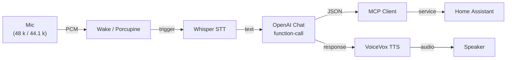

# SmartSpeaker2

A self-hosted, fully-async **smart-speaker pipeline**:

``Mic → Wake Word (Porcupine) → STT (Whisper) → LLM (function-call JSON) → Home Assistant → TTS (VoiceVox)``

※ HomeAssistant対応スマートスピーカー。Google Home では出来ない複合家電操作が狙いです。

---

## ✨ Features
| Status | Feature | Notes |
|--------|---------|-------|
| ✅ | **Wake-word detection** (Porcupine) | Sample-rate-agnostic buffering with `resample_poly` |
| ⚙️ | Compound commands | e.g. *“Turn **off** the AC **and** the lights.”* |
| ⚙️ | Voice switching | Any VoiceVox character |
| 📝 | Actionable HA notifications | Planned (post-MVP) |

---

## Quick Start ⚠️ *Experimental*

> **⚠️  This section has **not** been fully verified yet.**  
> 実機での動作はまだ検証中です。手順が変わる可能性があります。

```bash
git clone https://github.com/Karimera1696/SmartSpeaker2
cd SmartSpeaker2
cp .env.example .env  # ← fill tokens later
poetry install --no-root
poetry run python -m smartspeaker2 --help
```
<!-- TODO: Verify end-to-end pipeline on Raspberry Pi (July 2025) -->

## High-level Architecture



---

## Roadmap (2025)

* **July**  : Async refactor & CI (ruff, mypy, pytest)
* **Aug-Mid** : *MVP* – end-to-end voice ⇄ voice, README video
* **Aug-End** : Docs & Test coverage ≥ 80 %
* **Sep**     : Compound HA actions + HA notification PoC
* **Oct**     : Portfolio polish / interview prep

---

## Development

```bash
# run all linters & tests
poetry run task ci
# run single test (async)
pytest -k wake -q
```

### Commit Style

We follow **Conventional Commits** (`feat`, `fix`, `docs`, …).
Scopes map to top-level directories, e.g. `feat(wake): add resample_poly buffering`.
